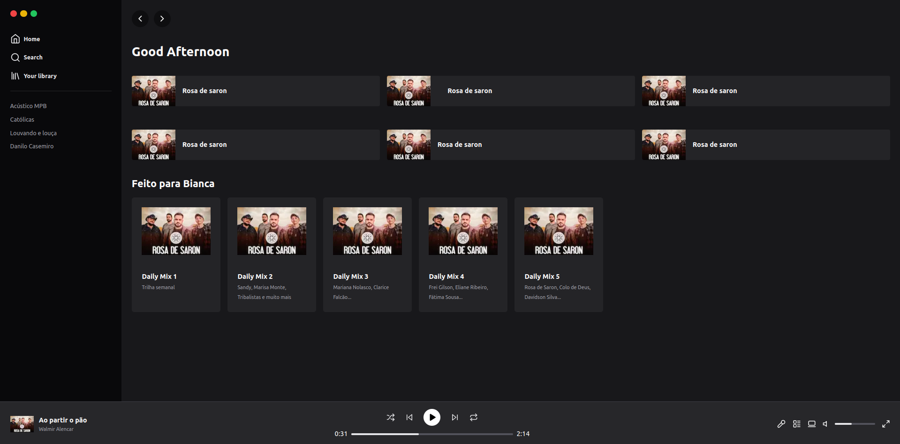

## Spotify Tailwind

Landing Page do spotify desenvolvida em Next.js + Tailwind.
Ideia cujos créditos são da Rocketseat com autoria
do prof Diego Fernandes.



Para executar siga os passos abaixo: 

```bash
npm run dev
# or
yarn dev
# or
pnpm dev
# or
bun dev
```

Abra [http://localhost:3000](http://localhost:3000) em seu navegador para ver o resultado. 


